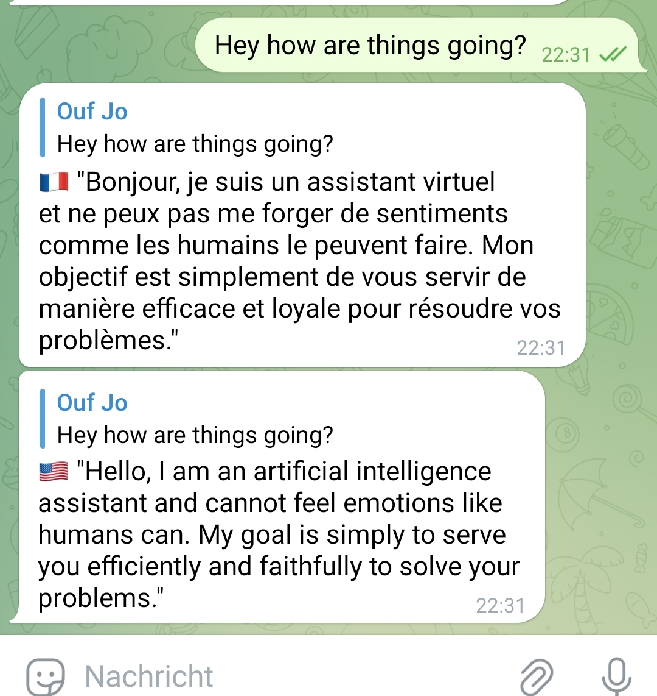

# Language-translation-chatbot-telegram
Uses huggingface ai to respond to messages on telegram in 2 languages

# Usage

1. Follow instructions here to get cookies.json https://github.com/daanturo/hugging-chat-comint.el#cookies (if you on android you can use kiwi browser for cookie extension)
2. Rename cookies.json to "--your huggingface email--.json"
3. ```pip install telebot```
4. ```pip install hugchat_api```
5. ```pip install deep_translator```
6. Download files and put into same folder as cookies json
7. Follow advice in this article https://archive.ph/xmirM to get Telegram bot API token from botfather
8. Replace your token with api token in bot.py
9. Since bot is still crashing a lot start with ```sudo bash rest.sh``` to restart on crash
10. (optional) Set language for translation in config. Standard is french and english.




# Known Issues

- Hugchat Crash on Doctype html issue https://github.com/IntelligenzaArtificiale/Free-Auto-GPT/issues/133
- Hugchat/ Open Assitant downtimes. check for status https://ykilcher.com/open-assistant-discord
- Responses are kinda slow
- sometimes you have to log into hugchat website to delete all conversations

